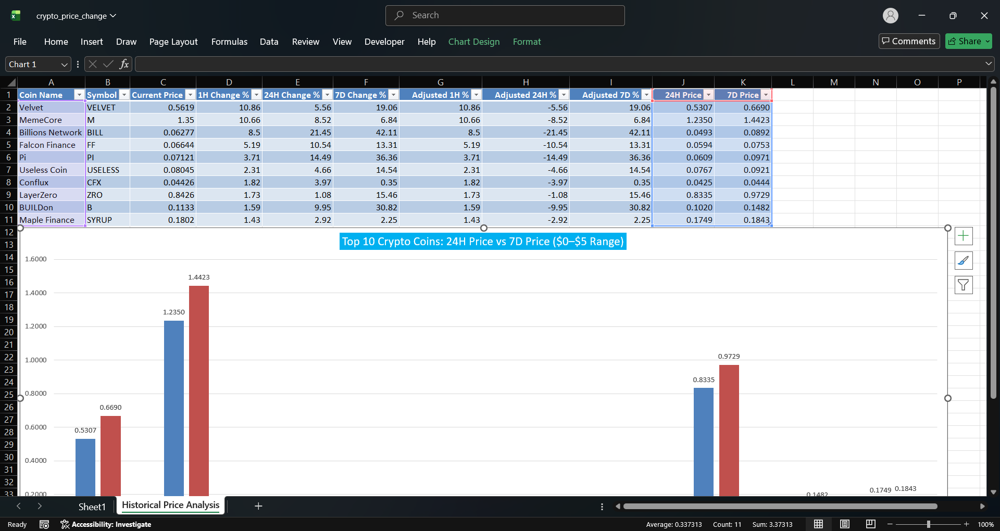
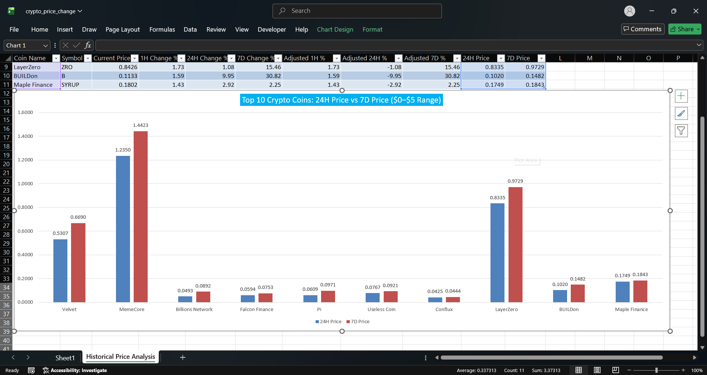

# Historical Price Change Insights Scrape

## Project Overview

This project analyzes historical cryptocurrency price movements by collecting data from CoinMarketCap using Selenium and Python.

The project scrapes information for the top **200 cryptocurrencies** (using Page 1 and Page 2), preprocesses the data based on the given assumptions, and creates an Excel dashboard that compares the estimated **24-Hour Price** and **7-Day Price** for the top performing cryptocurrencies.

The analysis focuses on cryptocurrencies priced between **$0 and $5**, helping identify coins that experienced significant short-term price movement.

---

# Objective

The objective of this project is to:

- Scrape cryptocurrency market data automatically.
- Perform data preprocessing using assignment assumptions.
- Filter cryptocurrencies within a specific price range.
- Rank coins based on 1-hour price change.
- Compare estimated 24-hour and 7-day prices.
- Visualize the comparison using an Excel chart.

---

# Technologies Used

- Python 3.11
- Selenium
- Pandas
- OpenPyXL
- Microsoft Excel

---

# Project Structure

```
Historical Price Change Insights Scrape/
│
├── crypto_scraper.py
├── crypto_price_change.xlsx
├── README.md
├── requirements.txt
├── .gitignore
├── image1.png
├── image2.png
└── image3.png
```

---

# Dataset

The data is collected directly from:

https://coinmarketcap.com

The scraper collects approximately **200 cryptocurrencies** from:

- Page 1
- Page 2

Each record contains:

- Coin Name
- Symbol
- Current Price
- 1-Hour Change %
- 24-Hour Change %
- 7-Day Change %

---

# Data Preprocessing

The assignment requires the following assumptions.

### 1-Hour Change

Assume every 1-hour percentage represents an increase.

```
Adjusted 1H % = ABS(1H Change %)
```

---

### 24-Hour Change

Assume every 24-hour percentage represents a decrease.

```
Adjusted 24H % = -ABS(24H Change %)
```

---

### 7-Day Change

Assume every 7-day percentage represents an increase.

```
Adjusted 7D % = ABS(7D Change %)
```

---

# Price Calculations

The estimated prices are calculated using the following formulas.

### 24-Hour Price

```
24H Price =
Current Price × (1 + Adjusted 24H % /100)
```

---

### 7-Day Price

```
7D Price =
Current Price × (1 + Adjusted 7D % /100)
```

---

# Data Analysis Workflow

### Step 1

Scrape cryptocurrency data.

↓

### Step 2

Store the data in Excel.

↓

### Step 3

Apply preprocessing assumptions.

↓

### Step 4

Calculate

- Adjusted percentages
- Estimated 24H Price
- Estimated 7D Price

↓

### Step 5

Filter cryptocurrencies priced between

```
$0 – $5
```

↓

### Step 6

Sort the filtered data by

```
Adjusted 1H %
```

↓

### Step 7

Select the

```
Top 10 Coins
```

↓

### Step 8

Create a comparison chart showing

- 24-Hour Price
- 7-Day Price

---

# Output

The final workbook contains




- Raw cryptocurrency data
- Preprocessed values
- Calculated prices
- Top 10 filtered cryptocurrencies
- Comparison chart

---

# Key Features

✔ Automatic web scraping

✔ 200 cryptocurrency records

✔ Data preprocessing

✔ Historical price estimation

✔ Dynamic ranking

✔ Excel analysis

✔ Clustered Column Chart

---

# How to Run

### Clone the repository

```bash
git clone <repository-url>
```

---

### Install dependencies

```bash
pip install -r requirements.txt
```

---

### Run the scraper

```bash
python crypto_scraper.py
```

---

### Open

```
crypto_price_change.xlsx
```

to view the processed data and visualization.

---

# Learning Outcomes

Through this project, I learned

- Web scraping using Selenium
- Handling dynamic websites
- Data preprocessing
- Financial data analysis
- Excel visualization
- Python automation
- Working with large datasets

---

# Author

Veera Bala Satya Sai Appana

B.Tech Data Science

Aditya University