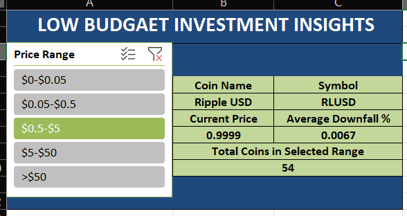

# Low Budget Investment Insights

## Project Overview

Low Budget Investment Insights is a KPI-based cryptocurrency dashboard developed using Python and Microsoft Excel. The project helps investors identify cryptocurrencies with the least average downfall percentage within different price ranges.

The dashboard dynamically filters cryptocurrencies based on their price range and displays the coin that has experienced the lowest average downfall percentage. This allows investors to make more informed decisions while considering low-budget investment opportunities.

The project uses real-time cryptocurrency data scraped from CoinMarketCap and performs data preprocessing before generating an interactive Excel dashboard.

---

## Problem Statement

Build a KPI-based dashboard to help investors identify coins with the least average downfall percentage.

Assumptions:
- 1-Hour Change Percentage represents a price downfall.
- 24-Hour Change Percentage represents a price downfall.
- 7-Day Change Percentage represents a price downfall.

Requirements:
- Scrape cryptocurrency data.
- Calculate the average downfall percentage.
- Create five KPI indicators:
  - Coin Name
  - Symbol
  - Current Price
  - Average Downfall Percentage
  - Total Coins in the selected price range
- Add a Price Range slicer with the following ranges:
  - $0 - $0.05
  - $0.05 - $0.5
  - $0.5 - $5
  - $5 - $50
  - Greater than $50
- Display the cryptocurrency with the least average downfall percentage in the selected price range.

---

## Technologies Used

### Programming Language

- Python 3.11

### Libraries

- Selenium
- Pandas
- OpenPyXL

### Tools Used

- Chrome for Testing
- Microsoft Excel
- Pivot Tables
- Slicers
- XLOOKUP
- CoinMarketCap

---

## Project Workflow

The project follows the workflow below:

```
CoinMarketCap
       ↓
Scrape Cryptocurrency Data
       ↓
Collect 200 Coins
       ↓
Clean and Preprocess Data
       ↓
Calculate Average Downfall %
       ↓
Categorize Coins by Price Range
       ↓
Export Data to Excel
       ↓
Create Pivot Tables
       ↓
Connect Slicer to Pivot Tables
       ↓
Build KPI Dashboard
       ↓
Display Investment Insights
```

---

## Data Collection

The project scrapes the following cryptocurrency information:

| Column Name |
|------------|
| Coin Name |
| Symbol |
| Current Price |
| 1H Change % |
| 24H Change % |
| 7D Change % |
| Average Downfall % |
| Price Range |

A total of 200 cryptocurrency coins are collected from CoinMarketCap.

---

## Data Preprocessing

The following preprocessing steps are performed:

### Percentage Cleaning

Special values such as:

- <0.01%
- >0.01%
- --
- Empty values

are handled appropriately before calculations.

---

### Average Downfall Calculation

The Average Downfall Percentage is calculated using:

```
Average Downfall Percentage =
(1H Change % + 24H Change % + 7D Change %) / 3
```

All percentage values are considered as price downfalls according to the problem statement.

---

### Price Range Categorization

Cryptocurrencies are grouped into the following categories:

| Price Range |
|------------|
| $0 - $0.05 |
| $0.05 - $0.5 |
| $0.5 - $5 |
| $5 - $50 |
| > $50 |

This categorization is used for dashboard filtering.

---

## Dashboard Features

The Excel dashboard provides the following KPIs:

| KPI |
|------|
| Coin Name |
| Symbol |
| Current Price |
| Average Downfall Percentage |
| Total Coins in Selected Range |

The dashboard dynamically updates whenever a different price range is selected using the slicer.

---

## Price Range Slicer

The slicer allows users to filter cryptocurrencies based on their investment budget.

Available options:

```
$0 - $0.05

$0.05 - $0.5

$0.5 - $5

$5 - $50

> $50
```

After selecting a price range, the dashboard automatically:

- Filters the available cryptocurrencies.
- Finds the cryptocurrency with the least average downfall percentage.
- Displays all KPI values.
- Displays the total number of cryptocurrencies available in that range.

---

## Dashboard Working

Example:

```
Selected Price Range:

$5 - $50


↓

Total Coins Available:

14


↓

Least Average Downfall Coin:

GateToken


↓

Dashboard Displays:

Coin Name:
GateToken

Symbol:
GT

Current Price:
6.73

Average Downfall Percentage:
0.13

Total Coins:
14
```

---

## Folder Structure

```
Low Budget Investment Insights

│
├── crypto_scraper.py
├── low_budget_investment_insights.xlsx
├── requirements.txt
├── README.md
│
└── Images
      ├── dashboard.png
      ├── slicer.png
      └── output.png
```

---

## How to Run the Project

### Step 1

Clone the repository:

```bash
git clone <repository-link>
```

---

### Step 2

Install the required libraries:

```bash
pip install -r requirements.txt
```

---

### Step 3

Download Chrome for Testing.

Update the Chrome binary path inside:

```python
options.binary_location
```

Example:

```python
r"D:\ChromeForTesting\chrome-win64\chrome.exe"
```

---

### Step 4

Run the Python script:

```bash
python crypto_scraper.py
```

The script will:

- Scrape cryptocurrency data.
- Perform preprocessing.
- Calculate the required metrics.
- Generate the Excel file.

---

### Step 5

Open:

```
low_budget_investment_insights.xlsx
```

and interact with the dashboard using the Price Range slicer.

---

## Output

The final dashboard provides:

- Interactive price range filtering.
- Dynamic KPI indicators.
- Average downfall percentage analysis.
- Budget-based cryptocurrency insights.
- Real-time investment decision support.

---

## Screenshots




---

## Conclusion

This project demonstrates how real-world cryptocurrency data can be transformed into meaningful investment insights using Python and Excel. By combining data scraping, preprocessing, and interactive dashboard design, the project provides an easy-to-understand investment analysis tool for identifying cryptocurrencies with minimal average downfall percentages across different price ranges.

---

## Author

**Veera Bala Satya Sai Appana**

B.Tech - Data Science  
Aditya University
