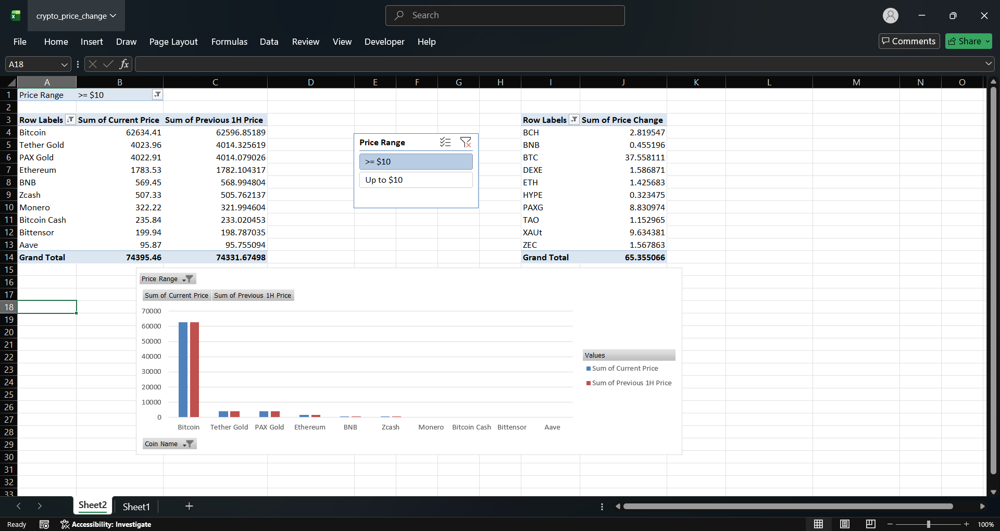
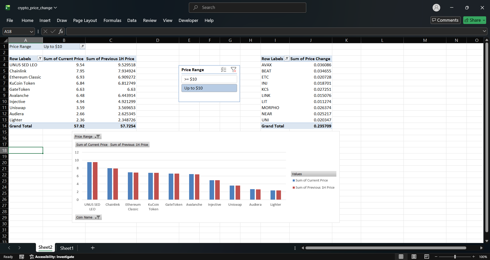

# 📈 Price Change Comparison Analysis

## Overview

The **Price Change Comparison Analysis** project is a cryptocurrency trend analysis dashboard that compares the **current market price** of cryptocurrencies with their **estimated previous 1-hour price**.

The project automatically scrapes cryptocurrency data from **CoinMarketCap**, calculates the previous price using the 1-hour percentage change, and generates an interactive Excel dashboard for comparison and analysis.

This project demonstrates **web scraping, data preprocessing, trend analysis, and Excel dashboard development**.

---

# Features

- Scrapes the **Top 100 cryptocurrencies** from CoinMarketCap
- Calculates the estimated **Previous 1-Hour Price**
- Calculates the **Price Change**
- Categorizes cryptocurrencies into:
  - Up to $10
  - Greater than or equal to $10
- Creates an interactive Excel dashboard
- Dynamic filtering using Excel Slicers
- Comparison chart between Current Price and Previous 1-Hour Price
- Symbol-wise Price Change table
- Automatically exports processed data to Excel

---

# Dashboard Components

The Excel dashboard contains:

## 1. Current Price vs Previous 1-Hour Price Chart

A clustered column chart comparing

- Current Price
- Previous 1-Hour Price

This helps visualize short-term price movement.

---

## 2. Price Range Slicer

Users can filter cryptocurrencies into:

- Up to $10
- >= $10

The slicer updates all dashboard visuals simultaneously.

---

## 3. Symbol vs Price Change Table

Displays:

- Cryptocurrency Symbol
- Calculated Price Change

The table is connected to the slicer for interactive analysis.

---

# Formula Used

Previous 1-Hour Price

```
Previous Price = Current Price / (1 + (1H Change % / 100))
```

Price Change

```
Price Change = Current Price − Previous Price
```

---

# Technologies Used

## Programming Language

- Python 3.11

## Libraries

- Selenium
- Pandas
- OpenPyXL

## Tools

- Microsoft Excel
- Pivot Tables
- Pivot Charts
- Excel Slicers
- Git
- GitHub
- Visual Studio Code

---

# Project Structure

```
Price Change Comparison Analysis
│
├── crypto_scraper.py
├── crypto_price_change.xlsx
├── requirements.txt
├── README.md
├── .gitignore
└── venv/
```

---

# Installation

## Clone Repository

```bash
git clone <repository-url>
```

Move into the project folder

```bash
cd "Price Change Comparison Analysis"
```

Create Virtual Environment

```bash
python -m venv venv
```

Activate Virtual Environment

### Windows

```bash
venv\Scripts\activate
```

### Linux / macOS

```bash
source venv/bin/activate
```

Install Dependencies

```bash
pip install -r requirements.txt
```

---

# How to Run

Run the scraper

```bash
python crypto_scraper.py
```

The program will:

1. Launch Selenium Chrome browser
2. Open CoinMarketCap
3. Load cryptocurrency data
4. Calculate previous 1-hour prices
5. Calculate price changes
6. Categorize cryptocurrencies by price range
7. Export results to

```
crypto_price_change.xlsx
```

---

# Creating the Dashboard

Open

```
crypto_price_change.xlsx
```

Create an Excel Table using **Ctrl + T**.

Create Pivot Tables.

Create:

- Current Price vs Previous 1-Hour Price chart
- Symbol vs Price Change table

Insert a Slicer using the **Price Range** field.

Connect the slicer to both Pivot Tables.

---

# Output

The generated Excel file contains:

| Column |
|----------|
| Coin Name |
| Symbol |
| Current Price |
| Previous 1H Price |
| 1H Change % |
| Price Change |
| Price Range |

---

# Sample Dashboard

Add your dashboard screenshot here.



```
images/dashboard.png
```

---

# Project Workflow

```
CoinMarketCap
        │
        ▼
 Selenium Web Scraping
        │
        ▼
 Data Cleaning
        │
        ▼
 Previous Price Calculation
        │
        ▼
 Price Change Calculation
        │
        ▼
 Price Range Classification
        │
        ▼
 Excel Export
        │
        ▼
 Pivot Tables
        │
        ▼
 Charts + Slicers
```

---

# Learning Outcomes

This project demonstrates knowledge of:

- Web Scraping using Selenium
- Dynamic webpage handling
- Data Cleaning
- Data Transformation
- Financial Trend Analysis
- Excel Dashboard Development
- Interactive Pivot Tables
- Pivot Charts
- Excel Slicers
- Python Automation

---

# Assumptions

- The 1-Hour percentage change represents the positive market movement used for estimating the previous price.
- Cryptocurrency prices are collected in real time from CoinMarketCap.
- Dashboard values depend on live market data and will change each time the scraper is executed.

---

# Future Improvements

- Real-time dashboard updates
- Historical price comparison
- Multi-timeframe analysis
- Interactive Power BI dashboard
- Export to CSV and SQL Database
- Automatic scheduled data collection

---

# Author

**Veera Bala Satya Sai Appana**

B.Tech Data Science

Aditya University

GitHub: *(Add your GitHub profile link here)*

---

# License

This project is developed for educational and internship purposes.